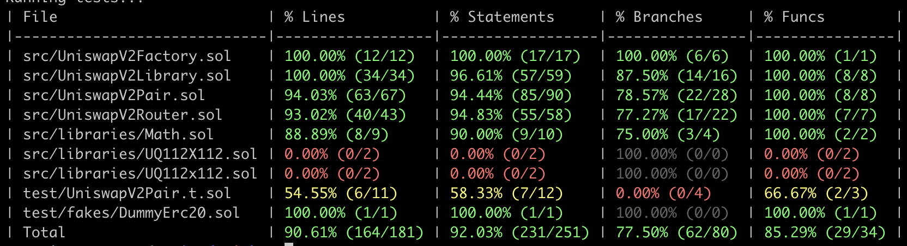

# INFO7500 Spring 2023 - Upgrade Uniswap V2 

<strong> Name - </strong> Arjun Raja Yogidas </br>
<strong> NUID - </strong> 002964082 </br>
<strong> Email - </strong> yogidas.a@northeastern.edu

<strong> Description:</strong> 
1. UniswapV2 was written three years ago and uses outdated versions of Solidity tools
2. Project goals:
   - Achieve deep knowledge of the UniswapV2 implementation
   - Learn Foundry, the next generation ethereum development environment
3. You may use any online resources for the project.
4. Read through the UniswapV2 code:
   https://github.com/Uniswap/v2-core
   https://github.com/Uniswap/v2-periphery
5. Copy the UniswapV2 code into a new Foundry project
   - The original code had the core and periphery contracts in different repos. We recommend combining them into a single repo to simplify development, and copying libraries rather than using package management.
   - UniswapV2Router01 should not be included.
6. Upgrade the UniswapV2 code to the latest Solidity version that Foundry supports.
7. Write Solidity tests that achieve >95% line coverage for each of the following contracts:
   - UniswapV2Router02
   - UniswapV2Pair
   - UniswapV2Factory
8. Generate and commit a line coverage report to assess the quality of your tests


### How to Run

- git clone ``` git@github.com:coderbirju/uniswap-upgrade.git ```
- Install [Foundry](https://book.getfoundry.sh/forge/forge-std)
- Install dependency contracts: git submodule update --init --recursive
- Run tests: forge test


## Coverage Report:

## Test Coverage Report
